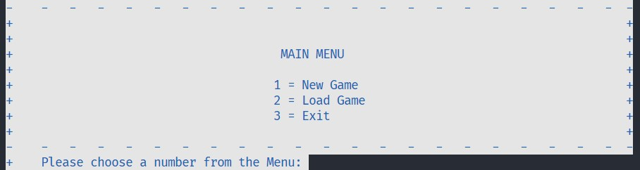
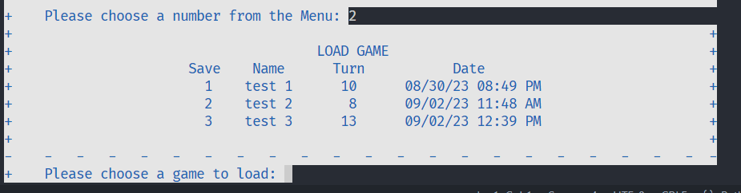
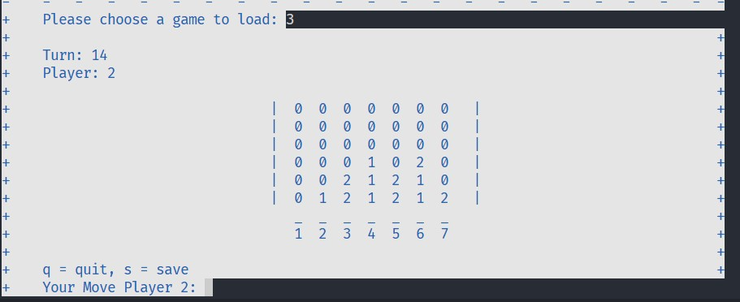

# Connect Five a CLI Game

This is a simple implementation of Connect Four that runs in the terminal.

## Installation

To install the Connect Five please follow these steps:

1. Clone the repo
`git clone https://github.com/Cravsi/ConnectFive.git
cd connect-five`

2. Create a virtual environment (not required)
`python -m venv venv`

3. Install Dependencies
`pip install -r requirements.txt`

4. Run the game
`python app.py`

## Usage

### Starting the Game

Run the game as described in the installation section

### Gameplay

This is a two player game. Each player take turns placeing their token in one of seven columns. The first to connect four tokens is the winner.

### Saving / Loading

The game can be saved at any time by selecting 's' during the player's turn. They will then enter a name for the save and it will be stored in a local SQLite database. The game can then be loaded from the main menu and resumed from the same turn.

### Quitting

The player can exit the game trough the main menu by selecting the third option or by selecting 'q' on their turn during a game.

## Features

### Main Menu

### Load Screen

### Game Screen

